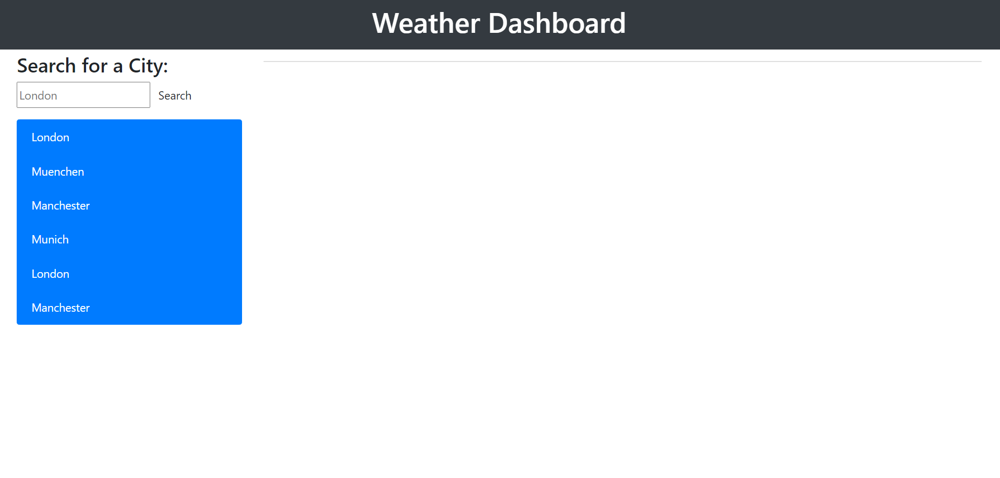
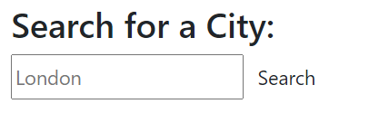
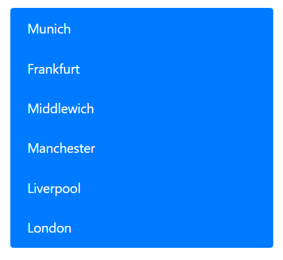
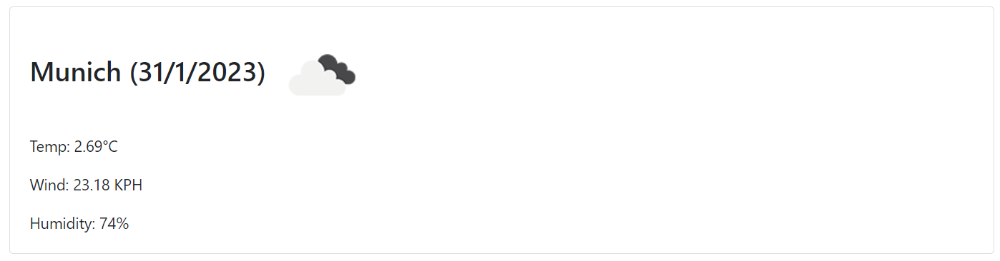

# Weather Dashboard
## Description
Welcome to the [Weather Dashboard](https://cl-lee.github.io/weather-dashboard/) repo! This project features a weather forecast app that can be used to view the weather outlook of a city in the world.

The app allows users to search for a city to view its weather forecast today and in the next five days. The app will also save the user's city search history, allowing them to view the city's weather forecast with just a click. Finally, the app will display a city's temperature, wind speed and humidity on the given dates.

## Prerequisites
A web browser is required to access the application.

## Usage
### Application link  
The application can be accessed through the following URL: https://cl-lee.github.io/weather-dashboard/.  
  

### Application usage
- #### Find a city
    - ##### The search box  
    Located on the top left corner of the web page is the city search box. Users can enter a city name here, and then click on the "search" button to find its weather forecast.  
      
    
    - ##### The search history bar
    Just under the search box is a bar that contains names of the six most recent searched cities. Users can click on any one of the cities to view its weather forecast.
      

- #### The weather sections
    - ##### Today's weather
    Today's weather information is displayed on the right side of the web page, just under the page header. This section contains the following elements:
    - Selected city's name, today's date, and an icon of today's weather outlook (e.g. sunny, cloudy, rainy, etc.)
    - Today's temperature
    - Today's wind-speed
    - Today's humidity  
      

    - ##### 
